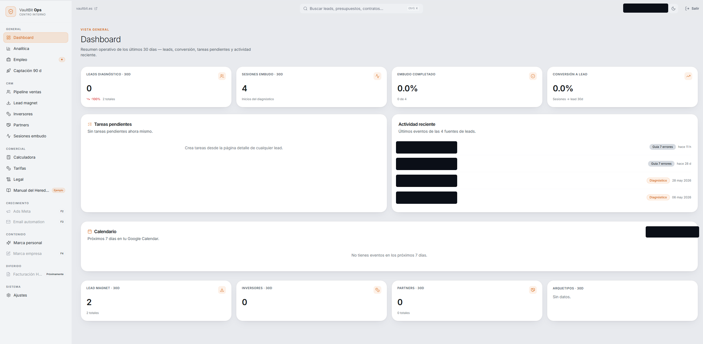
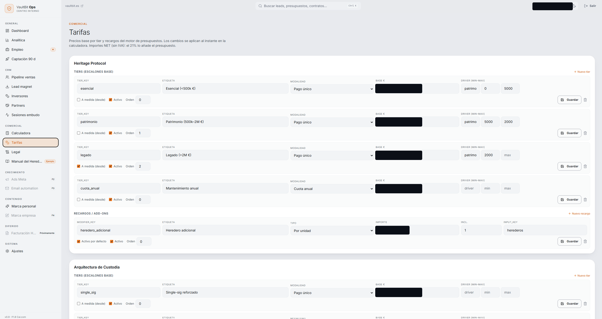
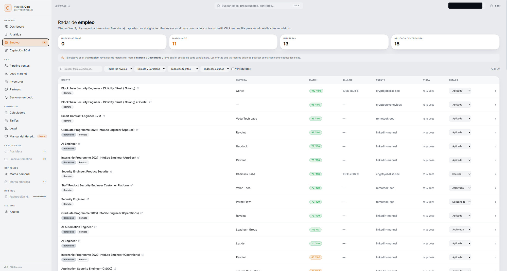
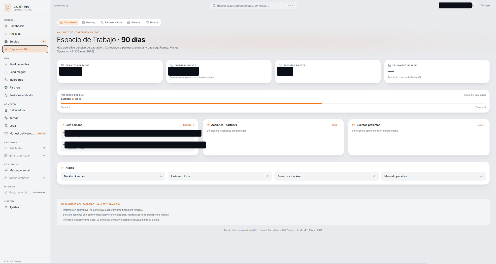

# Vaultbit Ops — internal CRM & operations console

A **real internal operations console running in production**, recently rebranded to *"Centro de Operaciones · Daniel Brosed"* with the danielbrosed.com visual identity. It runs the businesses of a developer / **application-security auditor**: leads and partner pipeline, quotes and contracts with PDF generation, a pricing engine, Cal.com bookings, a 90-day acquisition plan, a job-offers radar, and a **client-prospecting radar for the security-audit practice** (see *Client Scout* below), all fed by self-hosted n8n workflows.

> **About this repository.** This is a **sanitized public snapshot** of a private monorepo, published for portfolio review with fresh history through an allowlist-based pipeline (path allowlist → redaction transforms → secret/PII scanner + gitleaks as a hard gate). **No customer, partner, lead or prospect data lives in this repo** — data lives in Supabase behind RLS. It is intentionally **not runnable** without a configured Supabase project. All rights reserved.

## Stack

- **Next.js 15** (App Router) · **React 19** — Server Components + Server Actions
- **Supabase**: Postgres + Auth (magic link) + **RLS-first schema**
- Tailwind CSS 4 (design tokens, self-hosted fonts), `@react-pdf/renderer`, dnd-kit
- Docker `standalone` output (see the Dockerfile header: the production build context is the monorepo root), deployed as its own Dokploy application

## Architecture

- `src/app/(app)/…` — authenticated route group, organized **by business**: *Vaultbit Advisory* (the custody/inheritance consultancy) and *danielbrosed.com* (the personal brand — developer + security auditor, where the audit / smart-contract / prospecting work lives): CRM, comercial, empleo, **prospectos**, ajustes
- `src/lib/actions/` — Server Actions are the only write path from the UI
- `src/lib/queries/` — typed reads through the user-scoped Supabase client
- `src/middleware.ts` — session refresh + auth enforcement on every request
- `supabase/migrations/` — **16 SQL migrations: schema + RLS policies only, no data seeds** (the only seed migration is excluded from this snapshot by policy: *schema yes, rows no*)
- Two **self-hosted n8n workflows** feed the boards (code lives in the private repo, out of this snapshot): a *jobs watcher* and *Client Scout* (below). Both write to Supabase through PostgREST with a service-role credential that **never touches this codebase**.

## Client Scout — prospecting for the security-audit practice

The `/prospectos` board is the client radar for the **app-level security-audit and smart-contract work** the operator does under his personal brand (**danielbrosed.com**), not a separate business. It shows how a solo practice can build an ethical, mostly-free lead pipeline:

- An n8n workflow runs twice a day and collects **recently-launched web apps** from free, server-friendly sources (Show HN, Dev.to, and Spanish-market press), then runs a **passive fingerprint** on each: a single homepage GET, exactly what a browser does when you visit, to spot the build stack (Lovable/Bolt/Vercel/Netlify), whether Supabase/Firebase is used client-side, and missing security headers. From those **public signals only** it scores how much each app would benefit from a review.
- A daily analyst step (an agent) researches the best leads with **passive OSINT** (verified against two public sources, nothing invented) and drafts a first message.
- **Guardrails, by design:** OSINT only — never endpoint probing, enumeration, login attempts or any intrusive testing; any secret spotted in a public bundle is **redacted** (`first4…last4`), never stored in the clear; outreach is value-first and **never implies intrusion**; a human reviews and sends every message.

The board triages each prospect through a pipeline (`nuevo → investigado → contactado → … → cliente`), and the analyst step learns from those outcomes.

## Security decisions

- **Magic-link auth + email allowlist**, enforced in middleware and post-auth in Server Components (`src/lib/auth/allowlist.ts`); self-service signup is disabled at the login form and in Auth config.
- **RLS on every table**: each migration ships its policies. The app runs with the anon/user key; the n8n workflows write through PostgREST with a service-role credential that never touches this codebase.
- **Per-identity RLS** (the follow-up noted in earlier snapshots) is now implemented for the newest sensitive table (`audit_leads`, which holds third-party contact data): reads/writes are gated by an `authorized_users` allowlist through a `SECURITY DEFINER public.is_authorized()` function that checks the caller's JWT email, rather than the bare `authenticated` role — see the `2026-07-16-audit-leads.sql` migration.
- Outbound email goes through an n8n webhook so SMTP credentials never live in the app.
- Cal.com webhook ingestion is **HMAC-verified**; rate limiting and timing-safe comparisons on sensitive endpoints.
- This snapshot was produced by a publishing gate that redacts infrastructure identifiers and hard-fails on any secret/PII pattern.

## Screenshots

The console is not runnable without a configured Supabase project, so these are captures from the running instance. **Sensitive fields (personal email, third-party lead names, internal pricing and business figures) are covered with opaque redaction bars — the underlying pixels are destroyed, not blurred.**

*Dashboard: 30-day KPIs (leads, funnel sessions, conversion), task list and a live activity feed across lead sources.*

*Pricing engine: base tiers and modifiers per service line, edited in-place and applied instantly to the quote calculator (net amounts, VAT added at quote time).*

*Job radar: remote/Barcelona Web3-AI-security offers captured by an n8n watcher (2×/day), scored 0–100 against a profile, with per-offer triage state. Client Scout (the prospecting radar) mirrors this pattern for the security-audit practice.*

*90-day acquisition workspace: plan progress, weekly focus, partner actions and upcoming events, wired to the partners/events/backlog boards.*

## How it was built

Solo founder + Claude Code, in phased feature branches: scaffold & auth → CRM core → quotes/contracts + pricing engine → boards (acquisition, jobs, prospecting) → rebrand to the danielbrosed.com identity. Every phase ends with a quality review and a **security review** before merge.

## Live

Runs at a private URL for a single operator. This repo exists to show **how** it is built, not to be deployed by third parties.
